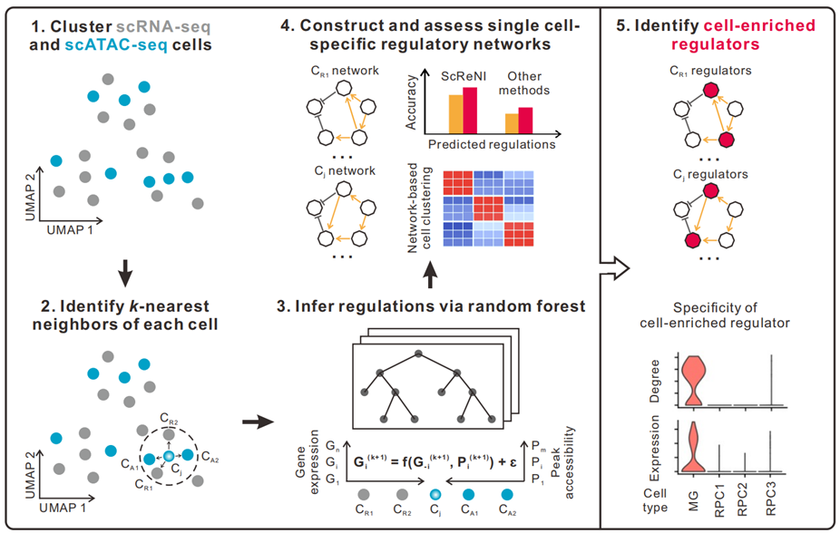

---
output: github_document
---

<!-- README.md is generated from README.Rmd. Please edit that file -->

```{r, include = FALSE}
knitr::opts_chunk$set(
  collapse = TRUE,
  comment = "#>",
  fig.path = "man/figures/README-",
  out.width = "100%"
)
```

# ScReNI: single-cell regulatory network inference through integrating scRNA-seq and scATAC-seq data

ScReNI is a new algorithm that harnesses the power of k-nearest neighbors and random forest classifiers to deduce regulatory networks for each cell. This method integrates single-cell RNA sequencing (scRNA-seq) and single-cell ATAC sequencing (scATAC-seq) data to provide a comprehensive view of cellular regulation. Notably, ScReNI is versatile, capable of being applied to both paired and unpaired scRNA-seq and scATAC-seq datasets. Additionally, ScReNI offers a distinctive feature: it enables the identification of regulators that are specifically enriched in each cell type, based on the cell-specific networks it constructs. 

ScReNI has the following four key steps:

* **clustering of cells measured by scRNA-seq and scATAC-seq**

* **identification of k-nearest neighbors for each cell**

* **inference of gene regulatory relationships via random forest**

* **reconstruction and evaluation of cell-specific regulatory networks**


{ width=70% height=70% }


## News

### Version 1.0.0: The first version of ScReNI was published!

### Installation

Install ScReNI from Github:
```r
install.packages('devtools')
devtools::install_github('Xuxl2020/ScReNI')
```

or download the source file and install it locally
```r
devtools::install_github('path/to/ScReNI.tar.gz')
```

To check if ScReNI is installed correctly, run the following:
```r
library(ScReNI)
```

## Example

We use unpaired scRNA-seq and scATAC-seq data from retinal development as example datasets.

[Using ScReNI to analyze unpaired scRNA-seq and scATAC-seq data from retinal development](https://htmlpreview.github.io/?https://github.com/Xuxl2020/ScReNI/blob/master/ScReNI-tutorial.html)


